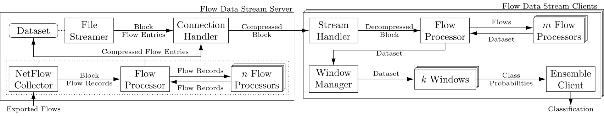

# Predictive-Network-Management (PNM)
## Prediction of Recurrent Flow Characteristics Using Time Scale Ensemble Learning
 **This is a seminar paper in the field of network traffic analysis using machine learning algorithms.**

### **Abstract**
The exponential growth of Internet traffic requires increasingly efficient resource utilization within network systems by providing both integrative and fine-grained management of network components. Recent advancements combine software-defined networking concepts and machine learning approaches in order to analyze network traffic behavior and enable automatic derivation of network and service management decisions, such as dynamic path determination based on predictions of network characteristics. A key challenge in classifying network flows is the adaptation to unforeseen changes in the underlying distribution of the data stream. This phenomenon, known as concept drift, leads to the degradation of deployed models resulting in poor predictions and decision outcomes. In this context, we present a network traffic classification method based on online ensemble learning. Specifically, a flow data stream is partitioned based on a set of windows with different time scales. Within the life cycle of each time window, both inference and training of a DNN is performed in an online fashion. The scores from the respective time windows are consolidated using an ensemble strategy. In this way, temporal dependencies between data instances are addressed and concept drifts of different types and speeds should be handled. Experiments on real network data demonstrate the accuracy performance of our approach in comparison to a single online model.

### Architecture Overview

An [implementation](https://github.com/mikepetersyn/Flow-Data-Streaming-Client-Ensemble) is provided to reproduce the presented results of the evaluation. The following diagram illustrates the architecture on a high-level view.

